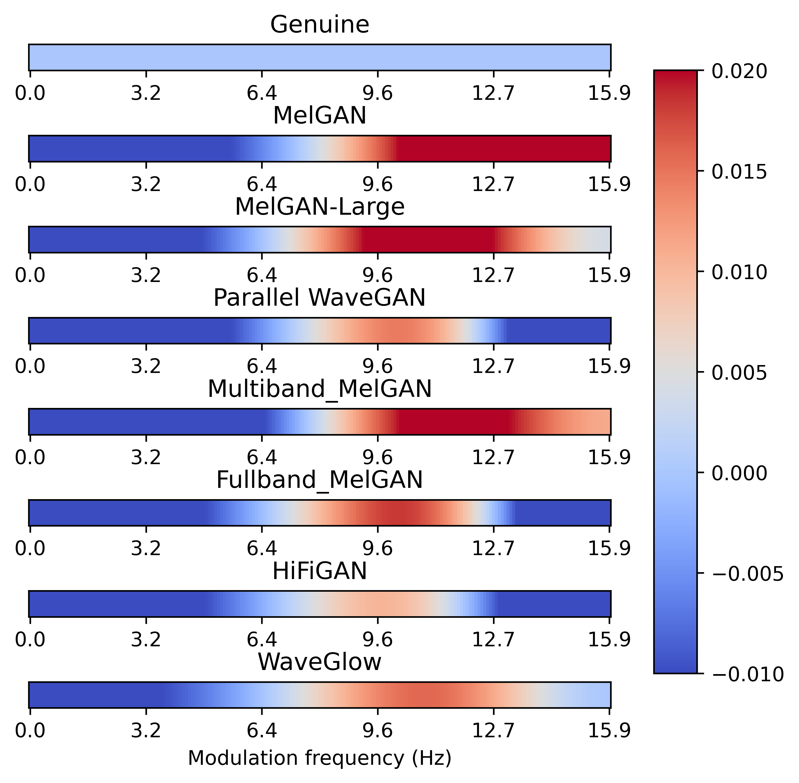

# Universal-representation-dynamics-of-deepfake-speech

This repo contains the implementation of the paper "Characterizing the temporal dynamics of universal speech representations for generalizable deepfake detection", by Yi Zhu, Saurabh Power, and Tiago H. Falk.

## Requirements and installations

* Python version == 3.10.2
* Pytorch version == 1.13.1
* Speechbrain version == 0.5.14
* torchaudio == 0.13.1

  ```shell
  cd YOUR-PROJECT-FOLDER
  git clone Universal-representation-dynamics-of-deepfake-speech
  pip install -r requirements.txt
  ```

## Data

We employed data from ASVspoof 2019 LA track and ASVspoof 2021 DF track. For both we are unfortuantely not authorised to re-distribute the data and labels. Related information can be found at the [challenge website](https://www.asvspoof.org/index2021.html).

### 2019 LA track

This track includes training, development, and evaluation sets, all zipped in the `LA.zip` file. [Download link](https://datashare.ed.ac.uk/handle/10283/3336)

### 2021 DF track

This track uses training and development data from the 2019 LA track, which is already included in the `LA.zip` file. The evaluation data can be accessed [here](https://zenodo.org/record/4835108).

## Getting started

We offer two ways to replicate our results:

1. Run `python exps/train.py exps/hparams/XXX.yaml` on your machine. This automatically trains and evaluates the model. However, you might need to first of all unzip all the downloaded files then edit the corresponding data paths in the `.yaml` file to point to your own data files.
2. Run `sbatch run.sh`. This bash script was submitted to Compute Canada cluster for model training and evaluation, so you may need to alter a few lines to meet your own requirements. This script moves all data to the desired folder, unzips them, and evaluates the models. We provide a more detailed instruction in the `batch_scripts` folder.

## Pre-trained models

We will soon release our pre-trained models in this repo.

## Apply the modulation transformation block to other representations

One of the key elements in our model is the modulation transformation block, this converts any 2D (feature by time) representation into another 2D dynamic representation. We experimented with wav2vec 2.0 and wavLM in this project, but the transformation can be scaled to other representations as well.

For flexibility, we defined an independent class `modulator` in the `ssl_family.py`. This class can be integrated with other DL model block. An examplar usage is provided as follows:

```python
from ssl_family import modulator

MTB = modulator(
		sample_rate=50,
		win_length=128,
		hop_length=32,
		)

input = torch.randn((1,1000,768)) # (bathc, time, feature_channel)

output = modulator(input)
print(output.shape)
```

Below is a visualization of the modulation dynamics of different deepfakes (same speech content, same speaker)



## Contact

For questions, contact us at [Yi.Zhu@inrs.ca]().
